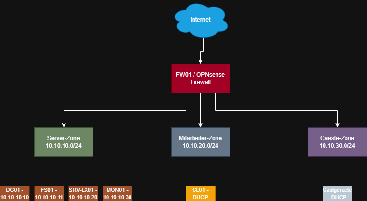

# Atlas-Rhein Handel GmbH — IT-Infrastruktur

📄 **[Projektdokumentation (PDF, 59 Seiten)](Projektdokumentation-Atlas-Rhein.pdf)**

## Umfang

| | |
|---|---|
| Virtuelle Maschinen | 6 (Firewall, Domänencontroller, Dateiserver, Linux-Server, Monitoring, Client) |
| Netzwerkzonen | 3 (Server, Mitarbeiter, Gäste) |
| Benutzerkonten | 20, per PowerShell aus CSV angelegt |
| Skripte | 15 (PowerShell und Bash) |
| Dokumentation | 59 Seiten (deutsch), inkl. Testprotokoll und Betriebshandbuch |
| Projektdauer | 6 Wochen |

## Abstract

This repository documents the design and implementation of a central
IT infrastructure for a simulated 20-employee trading company, built
entirely in a Microsoft Hyper-V lab. The environment covers an
Active Directory domain with centralized user management, network
segmentation enforced by an OPNsense firewall, a file server with
AGDLP-based permissions, a Nextcloud instance authenticating against
Active Directory over LDAPS, a 3-2-1 backup strategy implemented with
Veeam, and infrastructure monitoring with CheckMK. It was carried out
as a 6-week IHK-style project, including planning, implementation,
acceptance testing, and final documentation.

## Zusammenfassung

Dieses Repository dokumentiert Planung und Umsetzung einer zentralen
IT-Infrastruktur für ein simuliertes Handelsunternehmen mit 20
Mitarbeitern, aufgebaut in einem Hyper-V-Labor. Die Umgebung umfasst
eine Active-Directory-Domäne mit zentraler Benutzerverwaltung, eine
Netzwerksegmentierung mittels OPNsense-Firewall, einen Dateiserver
mit Berechtigungen nach dem AGDLP-Prinzip, eine Nextcloud-Instanz mit
Anmeldung über LDAPS gegen das Active Directory, eine Datensicherung
nach dem 3-2-1-Prinzip mit Veeam sowie ein Monitoring mit CheckMK.
Das Projekt wurde als sechswöchiges IHK-Projekt durchgeführt, inklusive
Planung, Umsetzung, Abnahmetests und Abschlussdokumentation.

## Architektur

Die Infrastruktur ist in drei Netzwerkzonen unterteilt (Server,
Mitarbeiter, Gäste), die über die OPNsense-Firewall FW01 voneinander
getrennt sind. Details zur Adressierung finden sich im
[IP-Konzept](docs/03-ip-konzept.md).

## Dokumentation

| Datei | Titel |
|---|---|
| [docs/01-projektantrag.md](docs/01-projektantrag.md) | Projektantrag |
| [docs/02-netzplan.png](docs/02-netzplan.png) | Netzplan |
| [docs/03-ip-konzept.md](docs/03-ip-konzept.md) | IP-Konzept |
| [docs/04-ad-design.md](docs/04-ad-design.md) | Active-Directory-Design |
| [docs/05-durchfuehrung.md](docs/05-durchfuehrung.md) | Durchführung |
| [docs/06-testprotokoll.md](docs/06-testprotokoll.md) | Testprotokoll |
| [docs/07-betriebshandbuch.md](docs/07-betriebshandbuch.md) | Betriebshandbuch |
| [docs/08-fazit.md](docs/08-fazit.md) | Fazit |

Der Ordner [scripts/](scripts/) enthält die nummerierten PowerShell-
und Bash-Skripte, mit denen die Infrastruktur aufgebaut wurde (u. a.
virtuelle Switches, VM-Erstellung, AD-Promotion, OU- und
Benutzeranlage, DHCP, Dateifreigaben und Nextcloud-Installation).
